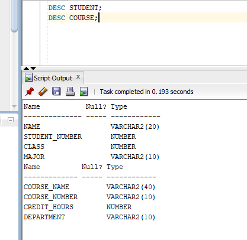
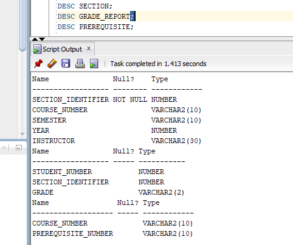
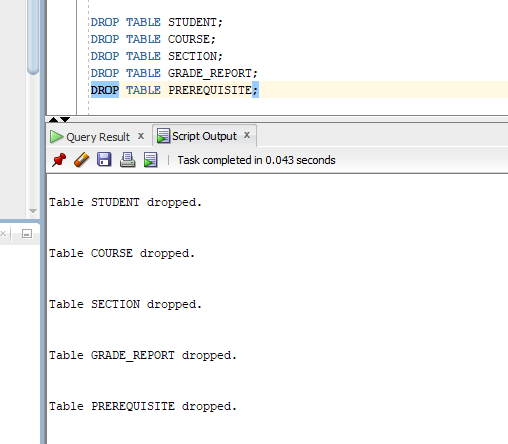
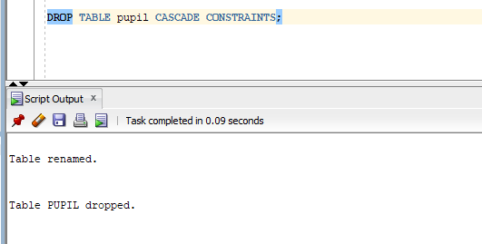
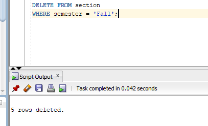
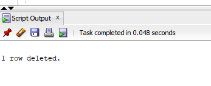

# (1b). 1. Create tables with constrains
...
CREATE TABLE student (
    student_number NUMBER PRIMARY KEY,
    student_name VARCHAR2(30) NOT NULL,
    class VARCHAR2(20),
    major VARCHAR2(20),
    branch VARCHAR2(20)
);

CREATE TABLE course (
    course_number NUMBER PRIMARY KEY,
    course_name VARCHAR2(30) NOT NULL,
    credit_hrs NUMBER
);

CREATE TABLE section (
    section_identifier NUMBER PRIMARY KEY,
    course_number NUMBER,
    semester VARCHAR2(20),
    year NUMBER,
    instructor VARCHAR2(30),
    FOREIGN KEY (course_number)
    REFERENCES course(course_number)
);

CREATE TABLE grade_report (
    student_number NUMBER,
    section_identifier NUMBER,
    grade VARCHAR2(5),
    PRIMARY KEY (student_number, section_identifier),
    FOREIGN KEY (student_number)
    REFERENCES student(student_number),
    FOREIGN KEY (section_identifier)
    REFERENCES section(section_identifier)
);

CREATE TABLE prerequisites (
    course_number NUMBER,
    prerequisite_number NUMBER,
    PRIMARY KEY (course_number, prerequisite_number),
    FOREIGN KEY (course_number)
    REFERENCES course(course_number)
);
...

# (1b).2.Display all values
...
DESC student;
DESC course;
DESC section;
DESC grade_report;
DESC prerequisites;
...

# (1b). 3. Insert the all values
...
INSERT INTO student VALUES (1, 'Anitha', 'CSE', 'CSE');
INSERT INTO student VALUES (2, 'Ravi', 'ECE', 'ECE');
INSERT INTO student VALUES (3, 'Sita', 'CSE', 'CSE');

INSERT INTO course VALUES (101, 'Database', 3);
INSERT INTO course VALUES (102, 'Data_structure', 3);
INSERT INTO course VALUES (103, 'Operating_System', 4);

INSERT INTO section VALUES (1, 101, 'Fall');
INSERT INTO section VALUES (2, 102, 'Spring');
INSERT INTO section VALUES (3, 103, 'Fall');

INSERT INTO grade_report VALUES (1, 1, 'A');
INSERT INTO grade_report VALUES (2, 2, 'B');
INSERT INTO grade_report VALUES (3, 3, 'A');

INSERT INTO prerequisites VALUES (101, 102);
INSERT INTO prerequisites VALUES (103, 101);

...

# (1b). 4. Display the all tables
...
SELECT * FROM student;

SELECT * FROM course;

SELECT * FROM section;

SELECT * FROM grade_report;

SELECT * FROM prerequisites;

...

# (1b). 5.All branch attribute in student table and describe the table
...
SELECT branch FROM student;

DESC student;

...

# (1b). 6.Copy major values into branch
...
UPDATE student
SET branch = major;

SELECT branch FROM student;

...

# (1b). 7.Remove major attribute
...
ALTER TABLE student
DROP COLUMN major;

...

# (1b). 8. Rename course_number to cid
...
ALTER TABLE course
RENAME COLUMN course_number TO cid;

DESC course;

...

# (1b). 9.Change database credit_hrs to 4
...
UPDATE course
SET credit_hrs = 4
WHERE course_name = 'Database';

SELECT * FROM course;

...

# (1b). 10.put NOT NULL constraint on Branch
...
ALTER TABLE student
MODIFY branch VARCHAR2(20) NOT NULL;

...

# (1b). 11. Rename student table to pupil
...
RENAME student TO pupil;

...

# (1b). 12.Remove student pupil table
...
DROP TABLE pupil CASCADE CONSTRAINTS;

...

# (1b). 13. Remove Fall semester rows
...
DELETE FROM section
WHERE semester='Fall';

...

# (1b). 14. Remove data_structure row
...
DELETE FROM course
WHERE course_name ='Data_structure';

...

# (1b). 15.Remove all rows using truncate
...
TRUNCATE TABLE grade_report;
TRUNCATE TABLE prerequisites;
TRUNCATE TABLE section;
TRUNCATE TABLE course;

...

# (1b). 16.Remove pupil,course and section to recycle bin
...
DROP TABLE pupil;
DROP TABLE course;
DROP TABLE section;

SHOW RECYCLEBIN;

...

# (1b). 17.Permanently remove grade_report and prerequisites
...
DROP TABLE grade_report PURGE;
DROP TABLE prerequisites PURGE;

...

