# (1a) 1. Create a tables from without constrains
...
CREATE TABLE STUDENT (
    Student_Number NUMBER,
    Student_Name VARCHAR2(30),
    Major VARCHAR2(30)
);

CREATE TABLE COURSE (
    Course_Number VARCHAR2(10),
    Course_Name VARCHAR2(50),
    Credit_Hours NUMBER
);

CREATE TABLE SECTION (
    Section_Identifier NUMBER,
    Course_Number VARCHAR2(10),
    Semester VARCHAR2(20),
    Year NUMBER,
    Instructor VARCHAR2(30)
);

CREATE TABLE GRADE_REPORT (
    Student_Number NUMBER,
    Section_Identifier NUMBER,
    Grade CHAR(2)
);

CREATE TABLE PREREQUISITE (
    Course_Number VARCHAR2(10),
    Prerequisite_Number VARCHAR2(10)
);
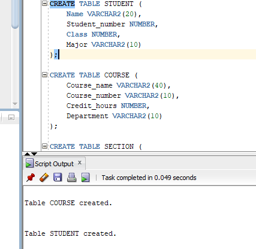
...

# (1a) 2.Insert a tables without constains
...
INSERT INTO STUDENT VALUES (1, 'Anitha', 'CSE');
INSERT INTO STUDENT VALUES (2, 'Rahul', 'ECE');
INSERT INTO STUDENT VALUES (3, 'Priya', 'CSE');
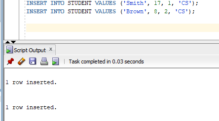
...

INSERT INTO COURSE VALUES ('C101', 'DBMS', 4);
INSERT INTO COURSE VALUES ('C102', 'Data Structures', 4);
INSERT INTO COURSE VALUES ('C103', 'Operating Systems', 3);
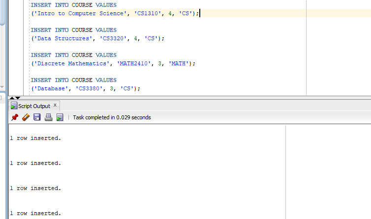

INSERT INTO SECTION VALUES (101, 'C101', 'I Semester', 2026, 'Ramesh');
INSERT INTO SECTION VALUES (102, 'C102', 'I Semester', 2026, 'Suresh');
INSERT INTO SECTION VALUES (103, 'C103', 'I Semester', 2026, 'Kiran');
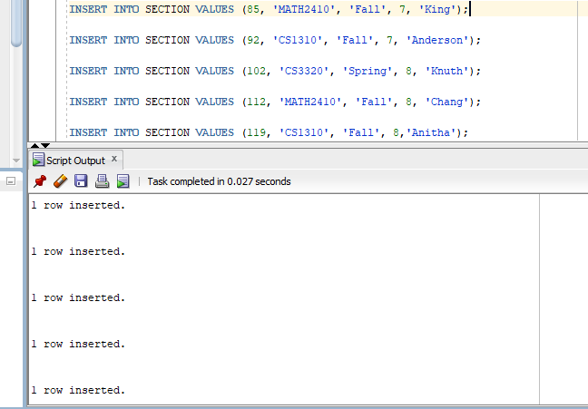

INSERT INTO GRADE_REPORT VALUES (1, 101, 'A');
INSERT INTO GRADE_REPORT VALUES (2, 102, 'B');
INSERT INTO GRADE_REPORT VALUES (3, 103, 'A');
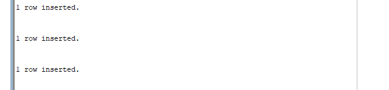

INSERT INTO PREREQUISITE VALUES ('C102', 'C101');
INSERT INTO PREREQUISITE VALUES ('C103', 'C101');
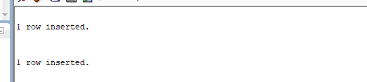
...

# (1a) 3.Describing a all tables
...
DESC student;
DESC Course;
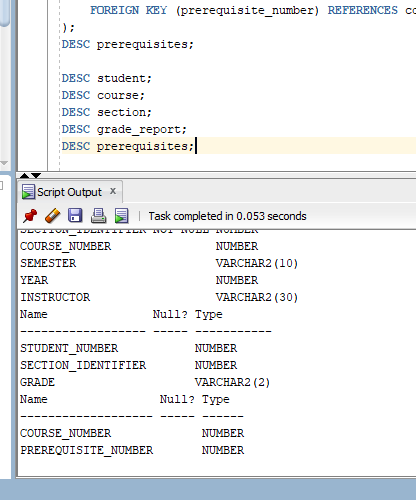

DESC Section;

DESC Grade_Report;

DESC Prerequisite;

...

# (1a) 5. Select all tables
...
SELECT * FROM STUDENT;
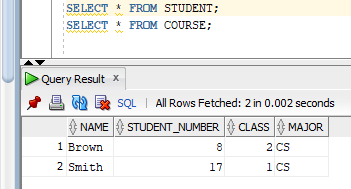

SELECT * FROM COURSE;
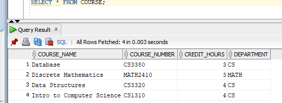

SELECT * FROM SECTION;
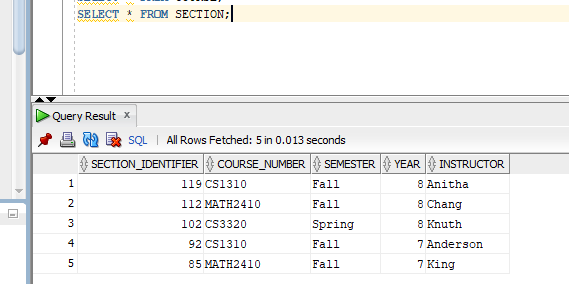

SELECT * FROM GRADE_REPORT;
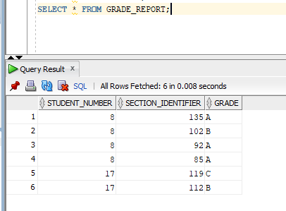

SELECT * FROM PREREQUISITE;
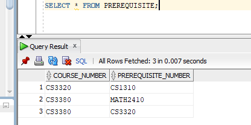

# (1a) 4. List the created tables
...
SELECT * FROM tab;

