# (3).1.Create view EMP-VIEW with all columns
```
CREATE VIEW EMP_VIEW AS
SELECT *
FROM EMPLOYEE;
```
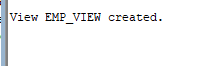
# (3).2.Create view EMP BASIC
```
CREATE VIEW EMP_BASIC AS
SELECT employee_id, first_name, last_name, department, salary
FROM EMPLOYEE;
```

# (3).3.Display all records from EMP-VIEW
```
SELECT *
FROM EMP_VIEW;
```
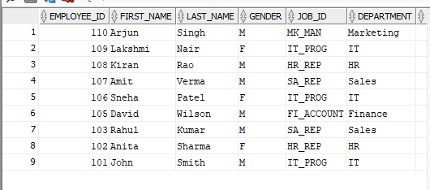
# (3).4.IT department view
```
CREATE VIEW IT_EMPLOYEES AS
SELECT *
FROM EMPLOYEE
WHERE department = 'IT';
```
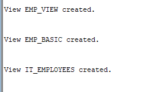
# (3).5.Salary>60000
```
CREATE VIEW HIGH_SALARY AS
SELECT *
FROM EMPLOYEE
WHERE salary > 60000;
```

# (3).6.Hyderabad employees
```
CREATE VIEW HYDERABAD_EMP AS
SELECT *
FROM EMPLOYEE
WHERE city = 'Hyderabad';
```
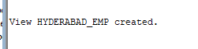
# (3).7.Female employees
```
Femal 
CREATE VIEW FEMALE_EMP AS
SELECT *
FROM EMPLOYEE
WHERE gender = 'F';
```
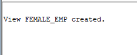
# (3).8.Hired on or after 01-JAN-2020
```
CREATE VIEW RECENT_EMPLOYEES AS
SELECT *
FROM EMPLOYEE
WHERE hire_date >= TO_DATE('01-JAN-2020', 'DD-MON-YYYY');
```

# (3).9.Display from HIGH SALARY view
```
SELECT employee_id, first_name, salary
FROM HIGH_SALARY;
```
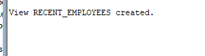
# (3).10.Replace EMP-BASIC by adding CITY
```
CREATE OR REPLACE VIEW HIGH_SALARY AS
SELECT employee_id, first_name, salary
FROM EMPLOYEE
WHERE salary > 5000;
```
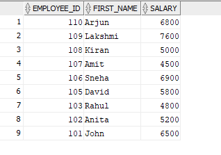
# (3).11.Read-only view
```
CREATE VIEW EMP_SALARY_VIEW AS
SELECT employee_id, first_name, last_name, salary
FROM EMPLOYEE
WITH READ ONLY;
```
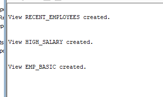
# (3).12.Sales view with CHECK OPTION
```
CREATE VIEW SALES_EMP AS
SELECT *
FROM EMPLOYEE
WHERE department = 'Sales'
WITH CHECK OPTION;
```
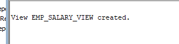
# (3).13.Update salary through EMP-BASIC
```
UPDATE EMP_BASIC
SET salary = 75000
WHERE employee_id = 101;
```
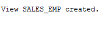
# (3).14.Delete through EMP-VIEW
```
DELETE FROM EMP_VIEW
WHERE employee_id = 107;
```

# (3).15.Insert into employee basic view
```
INSERT INTO EMP_BASIC
(employee_id, first_name, last_name, department, salary)
VALUES
(111, 'Ravi', 'Kumar', 'IT', 50000);
```

# (3).16.Structure of EMP-BASIC
```
DESC EMP_BASIC;
```

# (3).17.Display from IT-EMPLOYEES
```

SELECT *
FROM IT_EMPLOYEES;
```
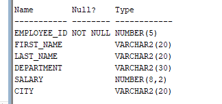
# (3).18.Salary>70000 from HIGH SALARY
```
SELECT *
FROM HIGH_SALARY
WHERE salary > 70000;
```
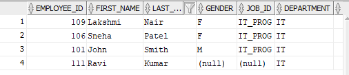
# (3).19.All female from FEMALE-EMP
```
SELECT *
FROM FEMALE_EMP;
```

# (3).20.Names and salaries from HYDERABAD-EMP
```
SELECT first_name, salary
FROM HYDERABAD_EMP;
```
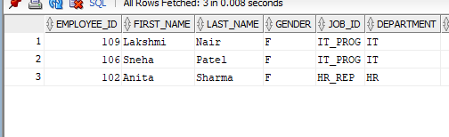
# (3).21,22,23.Drop views
```
DROP VIEW EMP_VIEW;

DROP VIEW HIGH_SALARY;

DROP VIEW EMP_BASIC;
```
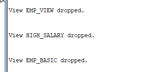
# (3).24.HR department view
```
CREATE VIEW HR_EMPLOYEES AS
SELECT *
FROM EMPLOYEE
WHERE department = 'HR';
```

# (3).25.Marketing department view
```
CREATE VIEW MARKETING_EMP AS
SELECT employee_id, first_name, department, salary
FROM EMPLOYEE
WHERE department = 'Marketing';
```

# (3).26.Top earners > 70000
```
CREATE VIEW TOP_EARNERS AS
SELECT *
FROM EMPLOYEE
WHERE salary > 70000;
```

# (3).27.EMP-CITY vew
```
CREATE VIEW EMP_CITY AS
SELECT employee_id, first_name, last_name, city
FROM EMPLOYEE;

COMMIT;
```

