# (3a). 1.Create table
```
CREATE TABLE EMPLOYEE (
    EMPLOYEE_ID NUMBER(5),
    FIRST_NAME VARCHAR2(20),
    LAST_NAME VARCHAR2(20),
    GENDER CHAR(1),
    JOB_ID VARCHAR2(15),
    DEPARTMENT VARCHAR2(30),
    SALARY NUMBER(8,2),
    COMMISSION NUMBER(5,2),
    HIRE_DATE DATE,
    CITY VARCHAR2(20)
);
```
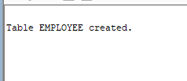

# (3a). 2.Insert values
```
INSERT INTO EMPLOYEE VALUES
(101, 'John', 'Smith', 'M', 'IT_PROG', 'IT', 65000, 5, '15-JAN-2020', 'Hyderabad');

INSERT INTO EMPLOYEE VALUES
(102, 'Anita', 'Sharma', 'F', 'HR_REP', 'HR', 52000, 3, '10-JUN-2019', 'Bengaluru');

INSERT INTO EMPLOYEE VALUES
(103, 'Rahul', 'Kumar', 'M', 'SA_REP', 'Sales', 48000, 8, '25-AUG-2021', 'Chennai');

INSERT INTO EMPLOYEE VALUES
(104, 'Priya', 'Reddy', 'F', 'MK_MAN', 'Marketing', 72000, 10, '05-MAR-2018', 'Hyderabad');

INSERT INTO EMPLOYEE VALUES
(105, 'David', 'Wilson', 'M', 'FI_ACCOUNT', 'Finance', 58000, NULL, '18-DEC-2017', 'Mumbai');

INSERT INTO EMPLOYEE VALUES
(106, 'Sneha', 'Patel', 'F', 'IT_PROG', 'IT', 69000, 6, '12-NOV-2022', 'Pune');

INSERT INTO EMPLOYEE VALUES
(107, 'Amit', 'Verma', 'M', 'SA_REP', 'Sales', 45000, 4, '20-JUL-2023', 'Delhi');

INSERT INTO EMPLOYEE VALUES
(108, 'Kiran', 'Rao', 'M', 'HR_REP', 'HR', 50000, NULL, '09-FEB-2021', 'Hyderabad');

INSERT INTO EMPLOYEE VALUES
(109, 'Lakshmi', 'Nair', 'F', 'IT_PROG', 'IT', 76000, 7, '14-SEP-2016', 'Kochi');

INSERT INTO EMPLOYEE VALUES
(110, 'Arjun', 'Singh', 'M', 'MK_MAN', 'Marketing', 68000, 5, '30-APR-2019', 'Jaipur');
```
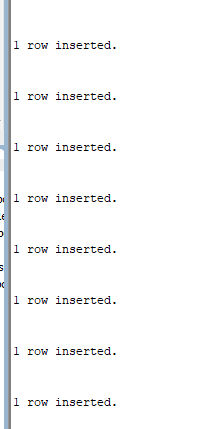

# (3a). 3.Display employee ID,first name and hire date in DD-MON-YYYY format
```
SELECT employee_id, first_name,
       TO_CHAR(hire_date, 'DD-MON-YYYY') AS hire_date
FROM EMPLOYEE;
```
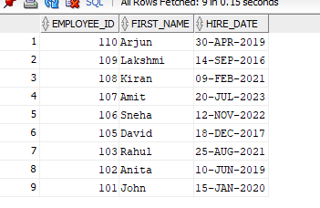
# (3a). 4.Display employee ID, first name and salary with currency symbol
```
SELECT employee_id, first_name,
       TO_CHAR(salary, 'L99999.99') AS salary
FROM EMPLOYEE;
```
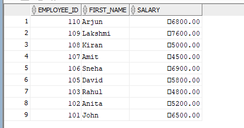
# (3a). 5.Add 5000 to each employee's salary using TO_NUMBER
```
SELECT employee_id, first_name,
       TO_NUMBER(salary) + 5000 AS new_salary
FROM EMPLOYEE;
```
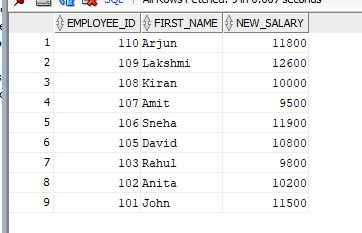
# (3a). 6.Display details of employees hired after 01-JAN-2020
```
SELECT *
FROM EMPLOYEE
WHERE hire_date > TO_DATE('01-JAN-2020', 'DD-MON-YYYY');
```
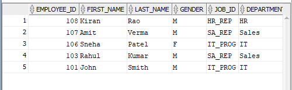
# (3a). 7.Display the full name by concatenating first name and last name using||
```
SELECT first_name || ' ' || last_name AS full_name
FROM EMPLOYEE;
```
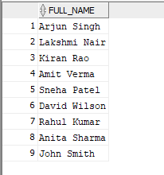
# (3a). 8.Concatenate first name and last name using CONCAT
```
SELECT CONCAT(first_name, last_name) AS full_name
FROM EMPLOYEE;
```
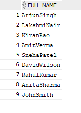
# (3a). 9.Display first name left padded with * using LPAD
```
SELECT LPAD(first_name, 10, '*') AS first_name
FROM EMPLOYEE;
```
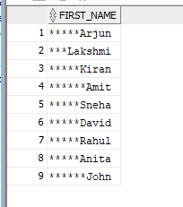
# (3a). 10.Display first name right padded with * using RPAD
```
SELECT RPAD(first_name, 10, '*') AS first_name
FROM EMPLOYEE;
```
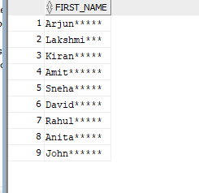
# (3a). 11.Remove leading spaces from first name using LTRIM
```
SELECT LTRIM(first_name) AS first_name
FROM EMPLOYEE;
```
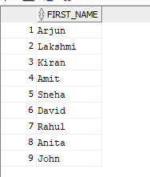
# (3a). 12.Remove trailing spaces from first name using RTRIM
```
SELECT RTRIM(first_name) AS first_name
FROM EMPLOYEE;
```
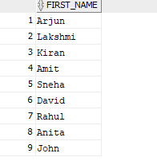
# (3a). 13.Display first names in lowercase
```
SELECT LOWER(first_name) AS first_name
FROM EMPLOYEE;
```
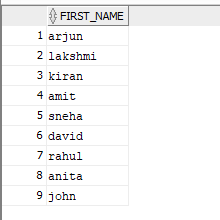
# (3a). 14.Display first names in uppercase
```
SELECT UPPER(first_name) AS first_name
FROM EMPLOYEE;
```
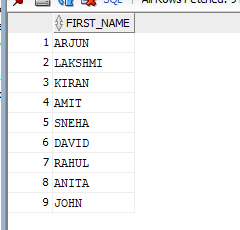
# (3a). 15.Display first names in proper case using INITCAP
```
SELECT INITCAP(first_name) AS first_name
FROM EMPLOYEE;
```
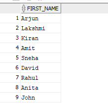
# (3a). 16.Display the length of each employees first name
```
SELECT first_name, LENGTH(first_name) AS name_length
FROM EMPLOYEE;
```
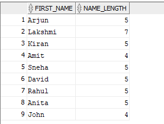
# (3a). 17.Display the first three characters of each first name using SUBSTR
```
SELECT first_name,
       SUBSTR(first_name, 1, 3) AS first_three_chars
FROM EMPLOYEE;
```
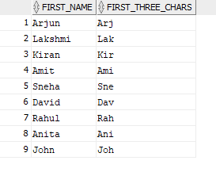
# (3a). 18.Find the position of a in each first name using INSTR
```
SELECT first_name,
       INSTR(LOWER(first_name), 'a') AS position_of_a
FROM EMPLOYEE;
```
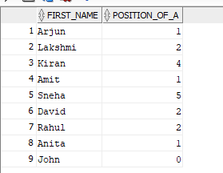
# (3a). 19.Display employee details along with the current system date using SYSDATE
```
SELECT employee_id, first_name, last_name, gender,
       job_id, department, salary, commission,
       hire_date, city, SYSDATE AS current_date
FROM EMPLOYEE;
```
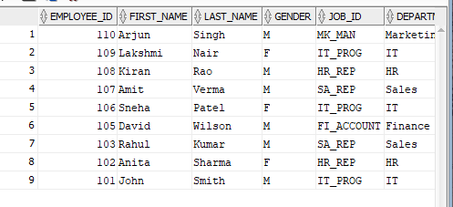
# (3a). 20.Display the next monday after each employees hire date
```
SELECT employee_id, first_name, hire_date,
       NEXT_DAY(hire_date, 'MONDAY') AS next_monday
FROM EMPLOYEE;
```
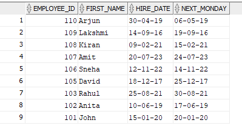
# (3a). 21.Display the date after adding 6 months to each hire date
```
SELECT employee_id, first_name, hire_date,
       ADD_MONTHS(hire_date, 6) AS date_after_6_months
FROM EMPLOYEE;
```
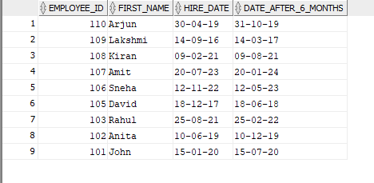
# (3a). 22.Display the last day of the month of each employees hire date
```
SELECT employee_id, first_name, hire_date,
       LAST_DAY(hire_date) AS last_day_of_month
FROM EMPLOYEE;
```
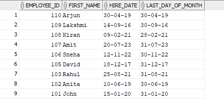
# (3a). 23.Calculate the total number of months worked using MONTHS_BETWEEN
```
SELECT employee_id, first_name, hire_date,
       MONTHS_BETWEEN(SYSDATE, hire_date) AS months_worked
FROM EMPLOYEE;
```
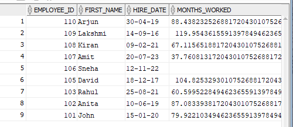
# (3a). 24.Display the smaller value between salary and 60000 using LEAST
```
SELECT employee_id, first_name, salary,
       LEAST(salary, 60000) AS smaller_value
FROM EMPLOYEE;
```
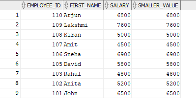
# (3a). 25.Display the greater value between salary 60000 using GREATEST
```
SELECT employee_id, first_name, salary,
       GREATEST(salary, 60000) AS greater_value
FROM EMPLOYEE;
```
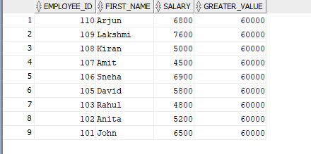
# (3a). 26.Display the first day of the month of each hire date using TRUNC
```
SELECT employee_id, first_name, hire_date,
       TRUNC(hire_date, 'MONTH') AS first_day_of_month
FROM EMPLOYEE;
```
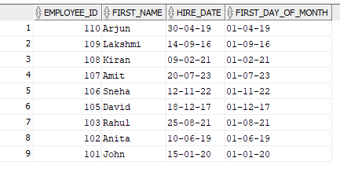
# (3a). 27.Round each hire date to the nearest month using ROUND
```
SELECT employee_id, first_name, hire_date,
       ROUND(hire_date, 'MONTH') AS rounded_month
FROM EMPLOYEE;
```
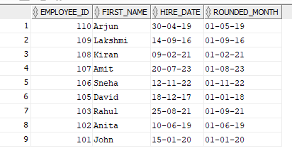
# (3a). 28.Display hire date in day,DD-MON-YYYY format
```
SELECT employee_id, first_name, hire_date,
       TO_CHAR(hire_date, 'DAY, DD-MON-YYYY') AS formatted_hire_date
FROM EMPLOYEE;
```
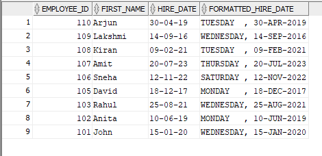
# (3a). 29.Display details of employees hired before 01-JAN-2019
```
SELECT *
FROM EMPLOYEE
WHERE hire_date < TO_DATE('01-JAN-2019', 'DD-MON-YYYY');
```
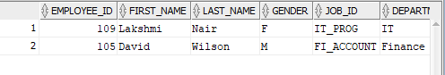
